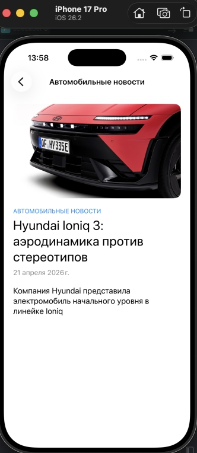
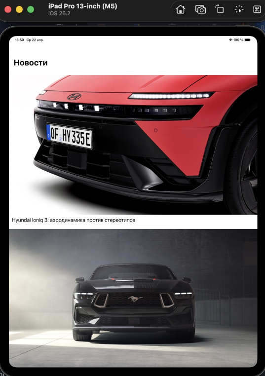
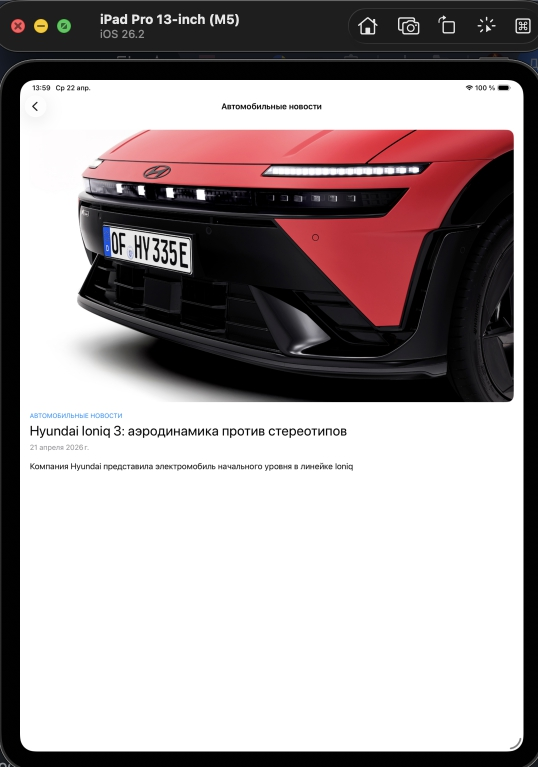

# AutodocFeed

Новостная лента на основе API Autodoc. Тестовое задание.

## Стек

- Swift 5.9+, iOS 16+
- UIKit, программный layout (без Storyboard/XIB)
- Архитектура: **MVVM-C** (Model-View-ViewModel-Coordinator)
- Async/Await, Combine (event publisher)
- Core Data (кэширование новостей)
- URLSession (сетевой слой)

## Архитектура

```
App/
├── SceneDelegate          — Composition Root (сборка зависимостей)

Core/
├── Networking/            — APIClient, Endpoint, NetworkError
├── ImageLoading/          — ImageLoader (actor), UIImageView+Loader
└── Caching/
    ├── CoreData/          — CoreDataStack, NewsCacheService, CachingNewsService
    └── DiskCache/         — DiskImageCache (actor)

Features/
└── Feed/
    ├── Coordinator/       — FeedCoordinator, навигация между экранами
    ├── List/              — FeedViewController, FeedViewModel, NewsCell
    ├── Detail/            — NewsDetailViewController (WKWebView)
    ├── Model/             — NewsItem, NewsResponse
    └── Service/           — NewsService, NewsServiceProtocol
```

### Слои

| Слой | Ответственность |
|------|----------------|
| **Networking** | Универсальный APIClient с generic `request<T: Decodable>` |
| **Service** | NewsService — получение новостей через APIClient |
| **Caching** | CachingNewsService (Decorator) — network-first, cache-fallback |
| **ViewModel** | Пагинация, управление состоянием, Combine publisher |
| **View** | UICollectionView с Compositional Layout и DiffableDataSource |
| **Coordinator** | Навигация, создание экранов |

## Ключевые решения

### Кэширование новостей — Decorator Pattern

```
ViewModel → CachingNewsService → NewsService (сеть)
                  ↓ ↑
            NewsCacheService (Core Data)
```

- Стратегия: **network-first, cache-fallback** — всегда актуальные данные, кэш при отсутствии сети
- Core Data модель создаётся программно (без .xcdatamodeld)
- TTL: 1 час, после чего записи считаются невалидными
- ViewModel не знает о кэшировании — подмена через протокол

### Трёхуровневый кэш изображений

```
1. NSCache (память)  → hit? return
2. DiskImageCache    → hit? return + сохранить в NSCache
3. URLSession (сеть) → сохранить на диск + в NSCache
```

- `ImageLoader` — actor, потокобезопасный
- `DiskImageCache` — actor, SHA256-ключи, LRU-eviction (150 MB / 7 дней)
- Image downsampling через `CGImageSource` — экономия памяти
- Двухфазная загрузка: размытый thumbnail → полное изображение

### UICollectionView

- `UICollectionViewCompositionalLayout` — адаптивный layout
- `DiffableDataSource` — декларативные обновления без `reloadData()`
- `UICollectionView.CellRegistration` — современный API регистрации ячеек
- Prefetching — упреждающая загрузка изображений

## API

```
GET https://webapi.autodoc.ru/api/news/{page}/{pageSize}
```

Возвращает `NewsResponse` с массивом новостей и общим количеством.

## Требования

- iOS 16.0+
- Xcode 16+

## Скриншоты





